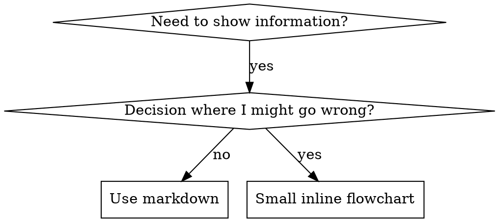

# Writing Skills

## Overview

**Writing skills IS Test-Driven Development applied to process documentation.**

**Managed skills in this repo live under `home/skills/` and deploy to `~/.codex/skills/`.**

You establish baseline evidence, write the skill (documentation), verify agents comply, and refactor (close loopholes). For new behavior, that usually means watching a baseline fail; for pure refactors under existing coverage, it can mean staying green.

**Core principle:** Establish the strongest honest evidence available for the change you are making. For new behavior, that usually means watching an agent fail without the skill first. For pure refactors under existing coverage, it can mean staying green and preserving verified behavior.

**REQUIRED BACKGROUND:** You MUST understand `test-driven-development` before using this skill. That skill defines the fundamental RED-GREEN-REFACTOR cycle. This skill adapts TDD to documentation.

**Official guidance:** For Anthropic's official skill authoring best practices, see anthropic-best-practices.md. This document provides additional patterns and guidelines that complement the TDD-focused approach in this skill.

## What is a Skill?

A **skill** is a reference guide for proven techniques, patterns, or tools. Skills help future agents find and apply effective approaches.

**Skills are:** Reusable techniques, patterns, tools, reference guides

**Skills are NOT:** Narratives about how you solved a problem once

## TDD Mapping for Skills

| TDD Concept | Skill Creation |
|-------------|----------------|
| **Test case** | Pressure scenario with subagent |
| **Production code** | Skill document (SKILL.md) |
| **Test fails (RED)** | For new behavior, agent violates rule without skill (baseline) |
| **Test passes (GREEN)** | Agent complies with skill present |
| **Refactor** | Close loopholes while maintaining compliance |
| **Write test first** | For new behavior, run baseline scenario before writing skill |
| **Watch it fail** | For new behavior, document exact rationalizations agent uses |
| **Minimal code** | Write skill addressing those specific violations |
| **Watch it pass** | Verify agent now complies |
| **Refactor cycle** | Find new rationalizations → plug → re-verify |

Skill creation follows the same discipline as RED-GREEN-REFACTOR: baseline evidence first for new behavior, or staying GREEN for pure refactors already protected by existing coverage.

## When to Create a Skill

**Create when:**
- Technique wasn't intuitively obvious to you
- You'd reference this again across projects
- Pattern applies broadly (not project-specific)
- Others would benefit

**Don't create for:**
- One-off solutions
- Standard practices well-documented elsewhere
- Project-specific conventions (put in `AGENTS.md` or other repo instruction files)
- Mechanical constraints (if it's enforceable with regex/validation, automate it—save documentation for judgment calls)

## Skill Types

### Technique
Concrete method with steps to follow (condition-based-waiting, root-cause-tracing)

### Pattern
Way of thinking about problems (flatten-with-flags, test-invariants)

### Reference
API docs, syntax guides, tool documentation (office docs)

## Directory Structure


```
skills/
  skill-name/
    SKILL.md              # Main reference (required)
    supporting-file.*     # Only if needed
```

**Flat namespace** - all skills in one searchable namespace

**Separate files for:**
1. **Heavy reference** (100+ lines) - API docs, comprehensive syntax
2. **Reusable tools** - Scripts, utilities, templates

**Keep inline:**
- Principles and concepts
- Code patterns (< 50 lines)
- Everything else

## SKILL.md Structure

**Frontmatter (YAML):**
- Two required fields: `name` and `description` (see [agentskills.io/specification](https://agentskills.io/specification) for all supported fields)
- Max 1024 characters total
- `name`: Use letters, numbers, and hyphens only (no parentheses, special chars)
- `description`: Third-person, describes ONLY when to use (NOT what it does)
  - Start with "Use when..." to focus on triggering conditions
  - Include specific triggering conditions, situations, and contexts
  - Bias toward recall over precision: false positives are better than false negatives
  - **NEVER summarize the skill's process or workflow** (see CSO section for why)
  - Keep under 500 characters if possible

```markdown
---
name: Skill-Name-With-Hyphens
description: Use when [specific triggering conditions and situations]
---

# Skill Name

## Overview
What is this? Core principle in 1-2 sentences.

## When to Use
[Small inline flowchart IF decision non-obvious]

Bullet list with SYMPTOMS and use cases
When NOT to use

## Core Pattern (for techniques/patterns)
Before/after code comparison

## Quick Reference
Table or bullets for scanning common operations

## Implementation
Inline code for simple patterns
Link to file for heavy reference or reusable tools

## Common Mistakes
What goes wrong + fixes

## Real-World Impact (optional)
Concrete results
```


## Skill Search Optimization (SSO)

**Critical for discovery:** Future agents need to FIND your skill

### 1. Rich Description Field

**Purpose:** The agent reads description to decide which skills to load for a given task. Make it answer: "Should I read this skill right now?"

**Format:** Start with "Use when..." to focus on triggering conditions

**CRITICAL: Description = When to Use, NOT What the Skill Does**

The description should ONLY describe triggering conditions. Do NOT summarize the skill's process or workflow in the description.

**Bias toward recall:** If a trigger is ambiguous, prefer a broader description that may cause the agent to read the skill and then decide it is unnecessary. Missing the right skill entirely is worse than loading a relevant skill one extra time.

**Why this matters:** Testing revealed that when a description summarizes the skill's workflow, the agent may follow the description instead of reading the full skill content. A description saying "code review between tasks" caused the agent to do ONE review, even though the skill's flowchart clearly showed TWO reviews (spec compliance then code quality).

When the description was changed to just "Use when executing implementation plans with independent tasks" (no workflow summary), the agent correctly read the flowchart and followed the two-stage review process.

**The trap:** Descriptions that summarize workflow create a shortcut the agent will take. The skill body becomes documentation the agent skips.

```yaml
# ❌ BAD: Summarizes workflow - the agent may follow this instead of reading skill
description: Use when executing plans - dispatches subagent per task with code review between tasks

# ❌ BAD: Too much process detail
description: Use for TDD - write test first, watch it fail, write minimal code, refactor

# ✅ GOOD: Just triggering conditions, no workflow summary
description: Use when executing implementation plans with independent tasks in the current session

# ✅ GOOD: Triggering conditions only
description: Use when implementing features, bug fixes, refactors, or behavior changes, before writing implementation code
```

**Content:**
- Use concrete triggers, symptoms, and situations that signal this skill applies
- Describe the *problem* (race conditions, inconsistent behavior) not *language-specific symptoms* (setTimeout, sleep)
- Keep triggers technology-agnostic unless the skill itself is technology-specific
- If skill is technology-specific, make that explicit in the trigger
- Write in third person (injected into system prompt)
- **NEVER summarize the skill's process or workflow**

```yaml
# ❌ BAD: Too abstract, vague, doesn't include when to use
description: For async testing

# ❌ BAD: First person
description: I can help you with async tests when they're flaky

# ❌ BAD: Mentions technology but skill isn't specific to it
description: Use when tests use setTimeout/sleep and are flaky

# ✅ GOOD: Starts with "Use when", describes problem, no workflow
description: Use when tests have race conditions, timing dependencies, or pass/fail inconsistently

# ✅ GOOD: Technology-specific skill with explicit trigger
description: Use when using React Router and handling authentication redirects
```

### 2. Keyword Coverage

Use words an agent would search for:
- Error messages: "Hook timed out", "ENOTEMPTY", "race condition"
- Symptoms: "flaky", "hanging", "zombie", "pollution"
- Synonyms: "timeout/hang/freeze", "cleanup/teardown/afterEach"
- Tools: Actual commands, library names, file types

### 3. Descriptive Naming

**Use active voice, verb-first:**
- ✅ `creating-skills` not `skill-creation`
- ✅ `condition-based-waiting` not `async-test-helpers`

### 4. Token Efficiency (Critical)

**Problem:** getting-started and frequently-referenced skills load into EVERY conversation. Every token counts.

**Target word counts:**
- getting-started workflows: <150 words each
- Frequently-loaded skills: <200 words total
- Other skills: <500 words (still be concise)

**Techniques:**

**Move details to tool help:**
```bash
# ❌ BAD: Document all flags in SKILL.md
search-conversations supports --text, --both, --after DATE, --before DATE, --limit N

# ✅ GOOD: Reference --help
search-conversations supports multiple modes and filters. Run --help for details.
```

**Use cross-references:**
```markdown
# ❌ BAD: Repeat workflow details
When searching, dispatch subagent with template...
[20 lines of repeated instructions]

# ✅ GOOD: Reference other skill
Always use subagents (50-100x context savings). REQUIRED: Use [other-skill-name] for workflow.
```

**Compress examples:**
```markdown
# ❌ BAD: Verbose example (42 words)
your human partner: "How did we handle authentication errors in React Router before?"
You: I'll search past conversations for React Router authentication patterns.
[Dispatch subagent with search query: "React Router authentication error handling 401"]

# ✅ GOOD: Minimal example (20 words)
Partner: "How did we handle auth errors in React Router?"
You: Searching...
[Dispatch subagent → synthesis]
```

**Eliminate redundancy:**
- Don't repeat what's in cross-referenced skills
- Don't explain what's obvious from command
- Don't include multiple examples of same pattern

**Verification:**
```bash
wc -w skills/path/SKILL.md
# getting-started workflows: aim for <150 each
# Other frequently-loaded: aim for <200 total
```

**Name by what you DO or core insight:**
- ✅ `condition-based-waiting` > `async-test-helpers`
- ✅ `using-skills` not `skill-usage`
- ✅ `flatten-with-flags` > `data-structure-refactoring`
- ✅ `root-cause-tracing` > `debugging-techniques`

**Gerunds (-ing) work well for processes:**
- `creating-skills`, `testing-skills`, `debugging-with-logs`
- Active, describes the action you're taking

### 4. Cross-Referencing Other Skills

**When writing documentation that references other skills:**

Use skill name only, with explicit requirement markers:
- ✅ Good: `**REQUIRED SUB-SKILL:** Use test-driven-development`
- ✅ Good: `**REQUIRED BACKGROUND:** You MUST understand systematic-debugging`
- ❌ Bad: `See skills/testing/test-driven-development` (unclear if required)
- ❌ Bad: `@skills/testing/test-driven-development/SKILL.md` (force-loads, burns context)

**Why no @ links:** `@` syntax force-loads files immediately, consuming 200k+ context before you need them.

## Flowchart Usage



**Use flowcharts ONLY for:**
- Non-obvious decision points
- Process loops where you might stop too early
- "When to use A vs B" decisions

**Never use flowcharts for:**
- Reference material → Tables, lists
- Code examples → Markdown blocks
- Linear instructions → Numbered lists
- Labels without semantic meaning (step1, helper2)

See @graphviz-conventions.dot for graphviz style rules.

**Visualizing for your human partner:** Use `render-graphs.js` in this directory to render a skill's flowcharts to SVG:
```bash
./render-graphs.js ../some-skill           # Each diagram separately
./render-graphs.js ../some-skill --combine # All diagrams in one SVG
```

## Code Examples

**One excellent example beats many mediocre ones**

Choose most relevant language:
- Testing techniques → TypeScript/JavaScript
- System debugging → Shell/Python
- Data processing → Python

**Good example:**
- Complete and runnable
- Well-commented explaining WHY
- From real scenario
- Shows pattern clearly
- Ready to adapt (not generic template)

**Don't:**
- Implement in 5+ languages
- Create fill-in-the-blank templates
- Write contrived examples

You're good at porting - one great example is enough.

## File Organization

### Self-Contained Skill
```
defense-in-depth/
  SKILL.md    # Everything inline
```
When: All content fits, no heavy reference needed

### Skill with Reusable Tool
```
condition-based-waiting/
  SKILL.md    # Overview + patterns
  example.ts  # Working helpers to adapt
```
When: Tool is reusable code, not just narrative

### Skill with Heavy Reference
```
pptx/
  SKILL.md       # Overview + workflows
  pptxgenjs.md   # 600 lines API reference
  ooxml.md       # 500 lines XML structure
  scripts/       # Executable tools
```
When: Reference material too large for inline

## The Iron Law (Same as TDD)

```
NO MATERIAL SKILL CHANGE WITHOUT BASELINE EVIDENCE FIRST
```

This applies to NEW skills AND EDITS to existing skills.

Write skill before testing? Stop forward edits and recover a real failing test.
Edit skill without testing? Same violation.

Recover from the violation the same way the canonical TDD skill does:
- discard disposable exploratory work and restart from an honest failing test
- or freeze forward edits and recover an honest failing test for the next unprotected behavior
- or, for pure refactors under existing coverage, stay green and strengthen coverage before changing behavior
- Don't "adapt" while running tests

**REQUIRED BACKGROUND:** The `test-driven-development` skill explains why this matters. Same principles apply to documentation.

## Testing All Skill Types

Different skill types need different test approaches:

### Discipline-Enforcing Skills (rules/requirements)

**Examples:** TDD, verification-before-completion, designing-before-coding

**Test with:**
- Academic questions: Do they understand the rules?
- Pressure scenarios: Do they comply under stress?
- Multiple pressures combined: time + sunk cost + exhaustion
- Identify rationalizations and add explicit counters

**Success criteria:** Agent follows rule under maximum pressure

### Technique Skills (how-to guides)

**Examples:** condition-based-waiting, root-cause-tracing, defensive-programming

**Test with:**
- Application scenarios: Can they apply the technique correctly?
- Variation scenarios: Do they handle edge cases?
- Missing information tests: Do instructions have gaps?

**Success criteria:** Agent successfully applies technique to new scenario

### Pattern Skills (mental models)

**Examples:** reducing-complexity, information-hiding concepts

**Test with:**
- Recognition scenarios: Do they recognize when pattern applies?
- Application scenarios: Can they use the mental model?
- Counter-examples: Do they know when NOT to apply?

**Success criteria:** Agent correctly identifies when/how to apply pattern

### Reference Skills (documentation/APIs)

**Examples:** API documentation, command references, library guides

**Test with:**
- Retrieval scenarios: Can they find the right information?
- Application scenarios: Can they use what they found correctly?
- Gap testing: Are common use cases covered?

**Success criteria:** Agent finds and correctly applies reference information

## Common Rationalizations for Skipping Testing

| Excuse | Reality |
|--------|---------|
| "Skill is obviously clear" | Clear to you ≠ clear to other agents. Test it. |
| "It's just a reference" | References can have gaps, unclear sections. Test retrieval. |
| "Testing is overkill" | Untested skills have issues. Always. 15 min testing saves hours. |
| "I'll test if problems emerge" | Problems = agents can't use skill. Test BEFORE deploying. |
| "Too tedious to test" | Testing is less tedious than debugging bad skill in production. |
| "I'm confident it's good" | Overconfidence guarantees issues. Test anyway. |
| "Academic review is enough" | Reading ≠ using. Test application scenarios. |
| "No time to test" | Deploying untested skill wastes more time fixing it later. |

**All of these mean: verify the skill in proportion to its type before deploying.**

## Bulletproofing Skills Against Rationalization

Skills that enforce discipline (like TDD) need to resist rationalization. Agents are smart and will find loopholes when under pressure.

**Psychology note:** Understanding WHY persuasion techniques work helps you apply them systematically. See persuasion-principles.md for research foundation (Cialdini, 2021; Meincke et al., 2025) on authority, commitment, scarcity, social proof, and unity principles.

### Close Every Loophole Explicitly

Don't just state the rule - forbid specific workarounds:

<Bad>
```markdown
Write code before test? Consider adding tests later.
```
</Bad>

<Good>
```markdown
Write code before test? Stop forward edits.

Recover by either discarding the spike and restarting from an honest failing test,
or freezing production changes until you recover an honest RED for the next behavior.
```
</Good>

### Address "Tests-After Is Fine" Arguments

Add the concrete recovery rule early:

```markdown
Stop forward edits and recover an honest RED before continuing.
```

This cuts off entire class of "I'm following the spirit" rationalizations.

### Build Rationalization Table

Capture rationalizations from baseline testing (see Testing section below). Every excuse agents make goes in the table:

```markdown
| Excuse | Reality |
|--------|---------|
| "Too simple to test" | Simple code breaks. Test takes 30 seconds. |
| "I'll test after" | Tests passing immediately prove nothing. |
| "Tests after achieve same goals" | Tests-after = "what does this do?" Tests-first = "what should this do?" |
```

### Create Red Flags List

Make it easy for agents to self-check when rationalizing:

```markdown
## Red Flags - STOP and Recover

- Code before test
- "I already manually tested it"
- "Tests after achieve the same purpose"
- "It's about spirit not ritual"
- "This is different because..."

**All of these mean: stop forward implementation and recover an honest RED, or explicitly treat the work as a green-only refactor under existing coverage.**
```

### Keep Description Focused On Triggering Conditions

Keep violation symptoms in the body, pressure scenarios, or rationalization table rather than in the description:

```yaml
description: use when implementing features, bug fixes, refactors, or behavior changes, before writing implementation code
```

## RED-GREEN-REFACTOR for Skills

Follow the TDD cycle:

### RED: Write Failing Test (Baseline)

For new behavior or behavior-changing edits, run pressure scenario with subagent WITHOUT the skill. For pure refactors under existing coverage, confirm the existing checks still protect the behavior you are editing. Document exact behavior:
- What choices did they make?
- What rationalizations did they use (verbatim)?
- Which pressures triggered violations?

For new behavior, this is "watch the test fail" for skills: see what agents naturally do before writing the skill. For pure refactors under existing coverage, preserve the verified behavior instead of forcing a fake failing baseline.

### GREEN: Write Minimal Skill

Write skill that addresses those specific rationalizations. Don't add extra content for hypothetical cases.

Run same scenarios WITH skill. Agent should now comply.

### REFACTOR: Close Loopholes

Agent found new rationalization? Add explicit counter. Re-test until bulletproof.

**Testing methodology:** See @testing-skills-with-subagents.md for the complete testing methodology:
- How to write pressure scenarios
- Pressure types (time, sunk cost, authority, exhaustion)
- Plugging holes systematically
- Meta-testing techniques

## Anti-Patterns

### ❌ Narrative Example
"In session 2025-10-03, we found empty projectDir caused..."
**Why bad:** Too specific, not reusable

### ❌ Multi-Language Dilution
example-js.js, example-py.py, example-go.go
**Why bad:** Mediocre quality, maintenance burden

### ❌ Code in Flowcharts
```dot
step1 [label="import fs"];
step2 [label="read file"];
```
**Why bad:** Can't copy-paste, hard to read

### ❌ Generic Labels
helper1, helper2, step3, pattern4
**Why bad:** Labels should have semantic meaning

## STOP: Before Moving to Next Skill

**After writing ANY skill, you MUST STOP and complete the deployment process.**

**Do NOT:**
- Create multiple skills in batch without testing each
- Move to next skill before current one is verified
- Skip testing because "batching is more efficient"

**The deployment checklist below is MANDATORY for EACH skill.**

Deploying untested skills = deploying untested code. It's a violation of quality standards.

## Skill Creation Checklist (TDD Adapted)

**IMPORTANT: Use TodoWrite to create todos for EACH checklist item below.**

**RED Phase - Write Failing Test:**
- [ ] For new behavior or behavior-changing edits: create pressure scenarios (3+ combined pressures for discipline skills)
- [ ] For new behavior or behavior-changing edits: run scenarios WITHOUT skill and document baseline behavior verbatim
- [ ] For green-only refactors under existing coverage: confirm existing tests still protect the behavior being edited
- [ ] Identify patterns in rationalizations/failures or coverage gaps

**GREEN Phase - Write Minimal Skill:**
- [ ] Name uses only letters, numbers, hyphens (no parentheses/special chars)
- [ ] YAML frontmatter with required `name` and `description` fields (max 1024 chars; see [spec](https://agentskills.io/specification))
- [ ] Description starts with "Use when..." and includes specific triggering conditions, not workflow or recovery symptoms
- [ ] Description written in third person
- [ ] Keywords throughout for search (errors, symptoms, tools)
- [ ] Clear overview with core principle
- [ ] Address specific baseline failures identified in RED
- [ ] Code inline OR link to separate file
- [ ] One excellent example (not multi-language)
- [ ] Run scenarios WITH skill - verify agents now comply

**REFACTOR Phase - Close Loopholes:**
- [ ] Identify NEW rationalizations from testing
- [ ] Add explicit counters (if discipline skill)
- [ ] Build rationalization table from all test iterations
- [ ] Create red flags list
- [ ] Re-test until bulletproof

**Quality Checks:**
- [ ] Small flowchart only if decision non-obvious
- [ ] Quick reference table
- [ ] Common mistakes section
- [ ] No narrative storytelling
- [ ] Supporting files only for tools or heavy reference

**Deployment:**
- [ ] Commit skill to git and push to your fork (if configured)
- [ ] Consider contributing back via PR (if broadly useful)

## Discovery Workflow

How a future agent finds your skill:

1. **Encounters problem** ("tests are flaky")
3. **Finds SKILL** (description matches)
4. **Scans overview** (is this relevant?)
5. **Reads patterns** (quick reference table)
6. **Loads example** (only when implementing)

**Optimize for this flow** - put searchable terms early and often.

## The Bottom Line

**Creating skills IS TDD for process documentation.**

Same discipline: establish baseline evidence first, or stay GREEN for pure refactors already protected by existing coverage.
Same cycle: RED (baseline) → GREEN (write skill) → REFACTOR (close loopholes).
Same benefits: Better quality, fewer surprises, bulletproof results.

If you follow TDD for code, follow it for skills. It's the same discipline applied to documentation.
