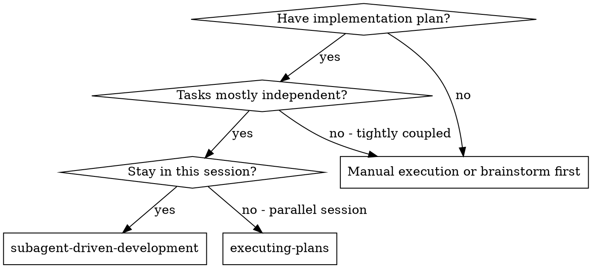

# Subagent-Driven Development

Execute plans by keeping a controller in the current session and pushing as much work as possible into implement and review lanes. When multiple slices are ready, run them in parallel. When only one slice is ready, use the same workflow sequentially rather than switching methods.

**Why subagents:** You delegate tasks to specialized agents with isolated context. By crafting their instructions and context precisely, you keep them focused and preserve the controller's context for planning, routing, and integration.

**Core principle:** Keep every stage busy. Multiple implementers and multiple reviewers can run in parallel, but every finished change still passes the same loop: implement -> spec review -> quality review -> integrate.

## When to Use



**Use this when:**
- You already have a written plan or a clean task list
- One or more tasks or slices are ready to execute in this session
- You want maximum throughput inside the current session
- You can tolerate controller overhead to gain better routing, review discipline, and integration quality

**The plan file is a live execution log.** The controller updates the markdown plan as work progresses:
- Change completed steps from `- [ ]` to `- [x]`
- Add an `Observed:` line directly under each completed step
- Capture what actually happened, including verification results, reviewer-driven fixes, surprises, and deviations from the original expectation

Keep a session tracker such as `update_plan` for execution tracking, but make the plan file itself readable as the durable execution record.

## Codex Prerequisites

This workflow assumes the current environment can coordinate subagents and maintain a live execution tracker.

- The leader is responsible for making implementer slices independent and safe to run concurrently. Use whatever isolation strategy fits the host and task, but do not dispatch overlapping write scopes.
- In a Codex-like host, use the host's subagent-dispatch and plan-tracking capabilities rather than assuming a specific tool name.
- In another host, use the closest equivalents for subagent dispatch, reviewer dispatch, and execution-state tracking.
- If the current environment cannot dispatch subagents, cannot route follow-up messages, or cannot track execution state cleanly, do not force this workflow. Use `executing-plans` or manual execution instead.

## The Process

```dot
digraph process {
    rankdir=TB;

    subgraph cluster_controller {
        label="Controller";
        "Read plan, extract tasks, note dependencies, create session tracker" [shape=box];
        "Split work into independent slices" [shape=box];
        "Keep implement lane full" [shape=box];
        "Keep review lane full" [shape=box];
        "Integrate accepted work and update plan file" [shape=box];
        "All slices integrated?" [shape=diamond];
        "Dispatch final code reviewer subagent for entire implementation" [shape=box];
    }

    subgraph cluster_loop {
        label="Per Slice";
        "Dispatch implementer subagent(s)" [shape=box];
        "Implementer asks for context?" [shape=diamond];
        "Answer and re-dispatch or unblock" [shape=box];
        "Implementer finishes slice with tests and self-review" [shape=box];
        "Dispatch spec reviewer subagent(s)" [shape=box];
        "Spec compliant?" [shape=diamond];
        "Implementer fixes spec gaps" [shape=box];
        "Dispatch quality reviewer subagent(s)" [shape=box];
        "Quality approved?" [shape=diamond];
        "Implementer fixes quality issues" [shape=box];
    }

    "Use finishing-a-development-branch" [shape=box style=filled fillcolor=lightgreen];

    "Read plan, extract tasks, note dependencies, create session tracker" -> "Split work into independent slices";
    "Split work into independent slices" -> "Keep implement lane full";
    "Keep implement lane full" -> "Dispatch implementer subagent(s)";
    "Dispatch implementer subagent(s)" -> "Implementer asks for context?";
    "Implementer asks for context?" -> "Answer and re-dispatch or unblock" [label="yes"];
    "Answer and re-dispatch or unblock" -> "Dispatch implementer subagent(s)";
    "Implementer asks for context?" -> "Implementer finishes slice with tests and self-review" [label="no"];
    "Implementer finishes slice with tests and self-review" -> "Keep review lane full";
    "Keep review lane full" -> "Dispatch spec reviewer subagent(s)";
    "Dispatch spec reviewer subagent(s)" -> "Spec compliant?";
    "Spec compliant?" -> "Implementer fixes spec gaps" [label="no"];
    "Implementer fixes spec gaps" -> "Dispatch spec reviewer subagent(s)" [label="re-review"];
    "Spec compliant?" -> "Dispatch quality reviewer subagent(s)" [label="yes"];
    "Dispatch quality reviewer subagent(s)" -> "Quality approved?";
    "Quality approved?" -> "Implementer fixes quality issues" [label="no"];
    "Implementer fixes quality issues" -> "Dispatch quality reviewer subagent(s)" [label="re-review"];
    "Quality approved?" -> "Integrate accepted work and update plan file" [label="yes"];
    "Integrate accepted work and update plan file" -> "Keep implement lane full";
    "Integrate accepted work and update plan file" -> "Keep review lane full";
    "Integrate accepted work and update plan file" -> "All slices integrated?";
    "All slices integrated?" -> "Keep implement lane full" [label="no"];
    "All slices integrated?" -> "Dispatch final code reviewer subagent for entire implementation" [label="yes"];
    "Dispatch final code reviewer subagent for entire implementation" -> "Use finishing-a-development-branch";
}
```



## Throughput Rules

- Default to multiple implementers when you have multiple ready slices. If only one slice is ready, keep the same workflow and run a single implement lane until more work opens up.
- Default to multiple reviewers when finished slices are waiting. Review is a parallel lane, not a single checkpoint.
- If throughput drops and there is finished work waiting for review, spawn another reviewer. More review capacity is usually cheaper than letting completed work sit idle.
- A reviewer can start as soon as a slice finishes, even while other implementers are still working.
- After a set of related slices is complete, dispatch an additional combined review for their seam if integration risk justifies it.
- If seam review finds follow-up work, treat that follow-up as a new seam slice with a clear owner. That seam slice must pass spec review and quality review like any other slice before it is considered done.
- Keep role ownership clear: implementers own their assigned slice, reviewers own review findings for a specific slice and stage.
- Do not serialize the whole plan around one task. Only serialize on real dependencies, shared write conflicts, or integration risk.
- Prefer smaller slices if that lets you keep more agents productive without collisions.

## Controller Responsibilities

The controller is not another implementer. The controller:

- reads the full plan once and extracts tasks with context
- identifies which slices are ready now and which are blocked by dependencies
- keeps enough implementers running to saturate ready work
- keeps enough reviewers running to prevent a review backlog
- routes review findings back to the right implementer
- integrates accepted work and updates the durable plan log

If the controller notices idle agents or completed work waiting in queue, rebalance immediately instead of waiting for the queue to clear itself.

## Slice Design

Split the plan into slices that are small enough to review quickly and independent enough to avoid merge pain.

Good slice boundaries:
- one feature flag or one spec section
- one module or file cluster with a clear owner
- one testable bugfix with a narrow blast radius

Bad slice boundaries:
- many unrelated edits handed to one implementer
- overlapping edits with unclear ownership
- review tasks that cover too much code to finish quickly

## The Review Loop

Every finished slice goes through the same loop:

1. An implementer completes the assigned slice, runs targeted tests, and performs self-review.
2. A spec reviewer checks only whether the slice matches the requested behavior and does not add unrequested scope.
3. If spec review fails, the slice goes back to the owning implementer for correction, then re-enters spec review.
4. After spec approval, a quality reviewer checks code quality, maintainability, tests, and local design fit.
5. If quality review fails, the slice goes back to the owning implementer for correction, then re-enters quality review.
6. After both reviews pass, the controller integrates the slice and updates the plan file.

This loop is mandatory per slice, but the loop itself can run for many slices in parallel.

Cross-slice seam fixes are not special exemptions. If seam review finds an issue, create a new seam slice, assign one owner, and run the same two review gates on that seam slice before integrating it.

## Model Selection

Use the least powerful model that can handle each role to conserve cost and increase speed.

**Mechanical implementation tasks** (isolated functions, clear specs, 1-2 files): use a fast, cheap model. Most slices are mechanical when the plan is well-specified.

**Integration and judgment tasks** (multi-file coordination, pattern matching, debugging): use a standard model.

**Architecture, design, and review tasks**: use the most capable available model.

**Task complexity signals:**
- Touches 1-2 files with a complete spec → cheap model
- Touches multiple files with integration concerns → standard model
- Requires design judgment or broad codebase understanding → most capable model

Use cheaper models to widen the implement lane. Spend stronger models on review, integration, and any slice that keeps bouncing.

## Handling Implementer Status

Implementer subagents report one of four statuses. Handle each appropriately:

**DONE:** Proceed to spec compliance review.

**DONE_WITH_CONCERNS:** The implementer completed the work but flagged doubts. Read the concerns before proceeding. If the concerns are about correctness or scope, address them before review. If they're observations (e.g., "this file is getting large"), note them and proceed to review.

**NEEDS_CONTEXT:** The implementer needs information that wasn't provided. Provide the missing context and re-dispatch.

**BLOCKED:** The implementer cannot complete the task. Assess the blocker:
1. If it's a context problem, provide more context and re-dispatch with the same model
2. If the task requires more reasoning, re-dispatch with a more capable model
3. If the task is too large, break it into smaller pieces
4. If the plan itself is wrong, escalate to the human

**Never** ignore an escalation or force the same model to retry without changes. If the implementer said it's stuck, something needs to change.

## Handling Review Capacity

Reviewers should not become the bottleneck.

- If one or more completed slices are waiting for spec review, dispatch more spec reviewers.
- If one or more spec-approved slices are waiting for quality review, dispatch more quality reviewers.
- If a reviewer returns low-signal comments, replace them or tighten the prompt. Do not let weak review slow the lane.
- If a slice keeps bouncing between implementer and reviewer, either upgrade the implementer model or narrow the slice.

Throughput matters. A finished implementation sitting unreviewed is wasted latency.

## Updating the Plan File

After each accepted slice, update the plan file before moving on:

1. Convert each completed task step from `- [ ]` to `- [x]`
2. Add an `Observed:` line directly under each completed step
3. Summarize the real outcome for that step, not the expected one:
   - actual test or verification result
   - fixes required after review
   - implementation surprises or deviations
   - notable constraints discovered during execution
4. If a step is still incomplete or blocked, leave it unchecked and add a brief `Blocked:` line directly under it

Do not wait until the end of the whole plan. Backfill the plan slice-by-slice while context is fresh.

## Prompt Templates

- `./implementer-prompt.md` - Dispatch implementer subagent
- `./spec-reviewer-prompt.md` - Dispatch spec compliance reviewer subagent
- `./code-quality-reviewer-prompt.md` - Dispatch code quality reviewer subagent

## Example Workflow

```
You: I'm using Subagent-Driven Development to execute this plan.

[Read plan file once: docs/agent/plans/feature-plan.md]
[Extract all 5 tasks with full text and context]
[Split into 3 ready slices and 2 dependent slices]
[Create update_plan tracker with all tasks]

Wave 1: start two implementers in parallel

Implementer A: Task 1: Hook installation script
Implementer B: Task 2: Recovery modes

Implementer A: "Before I begin - should the hook be installed at user or system level?"

You: "User level (~/.config/codex/hooks/)"

Implementer A: "Got it. Implementing now..."
Implementer B: [No questions, proceeds]

[Later]
Implementer A: DONE
  - Implemented install-hook command
  - Added tests, 5/5 passing
  - Self-review: Found I missed --force flag, added it
Implementer B: [still implementing Task 2]
  - Recovery modes implemented
  - Finishing tests and self-review

[Task 1 finishes]
[Dispatch spec reviewer for Task 1 immediately after Task 1 finishes]
Spec reviewer 1: ✅ Task 1 spec compliant

[Task 1 moves forward immediately]
[Dispatch quality reviewer for Task 1]
Quality reviewer 1: ✅ Approved

[Update plan file for Task 1]
[Launch Task 3 implementer while Implementer B is still working]

Implementer C: DONE
  - Completed Task 3
  - Ran targeted tests
  - Self-review: All good

[Task 2 finishes]
Implementer B: DONE
  - Added verify/repair modes
  - 8/8 tests passing
  - Self-review: All good
[Dispatch spec reviewer for Task 2]
Spec reviewer 2: ❌ Task 2 issues:
  - Missing progress reporting every 100 items
  - Added unrequested --json flag

[Route Task 2 back to Implementer B]
Implementer B: DONE
  - Removed --json flag
  - Added progress reporting

[Spec re-review for Task 2]
Spec reviewer 3: ✅ Task 2 spec compliant now

[Task 3 enters review]
[Dispatch spec reviewer for Task 3]
Spec reviewer 4: ✅ Task 3 spec compliant

[Dispatch quality reviewers for Task 2 and Task 3 in parallel]
Quality reviewer 2: Task 2 issue: magic number `100`
Quality reviewer 5: Task 3 approved

[Route Task 2 back to Implementer B]
Implementer B: DONE
  - Extracted `PROGRESS_INTERVAL`

[Quality re-review]
Quality reviewer 6: ✅ Task 2 approved

[Update plan file for Tasks 2 and 3]
[Dispatch combined seam review for Tasks 2 and 3 because they touch the same user flow]
Combined reviewer: ✅ Individual slices are fine, but integration needs one shared constant and one docs note
[Create new seam slice owned by Implementer B]
[Implement seam fix]
[Dispatch seam spec reviewer]
[Dispatch seam quality reviewer]
[Integrate seam slice after both reviews pass]
[Notice completed slices are waiting for review in the next wave]
[Spawn another reviewer rather than letting the queue build]

...

[After all tasks]
[Dispatch required final integrated reviewer]
Final reviewer: All requirements met across the full implementation, ready to merge

[Use finishing-a-development-branch]
Done.
```

## Advantages

**vs. Manual execution:**
- More total throughput because implement and review lanes stay busy
- Fresh context per slice reduces confusion
- Clear ownership per slice reduces accidental overlap
- Review happens continuously instead of bunching at the end

**vs. Executing Plans:**
- Same session, so the controller can rebalance instantly
- Parallel waves of implementers and reviewers
- Review backlog can be solved by adding more reviewers instead of waiting

**Efficiency gains:**
- No repeated plan-reading overhead
- Parallel review keeps finished work flowing
- Small slices surface issues earlier
- Controller curates exactly what context is needed
- Subagent gets complete information upfront
- Questions surfaced before work begins (not after)

**Quality gates:**
- Self-review catches issues before handoff
- Two-stage review: spec compliance, then code quality
- Review loops ensure fixes actually work
- Spec compliance prevents over/under-building
- Code quality ensures implementation is well-built

**Cost:**
- More subagent invocations (implementer + 2 reviewers per task)
- Controller does more prep work (extracting all tasks upfront)
- Review loops add iterations
- But catches issues early (cheaper than debugging later)

## Red Flags

**Never:**
- Start implementation on main/master branch without explicit user consent
- Skip reviews (spec compliance OR code quality)
- Proceed with unfixed issues
- Dispatch multiple implementation subagents in parallel when their write scope overlaps or ownership is unclear
- Make subagent read plan file (provide full text instead)
- Skip scene-setting context (subagent needs to understand where task fits)
- Ignore subagent questions (answer before letting them proceed)
- Accept "close enough" on spec compliance (spec reviewer found issues = not done)
- Skip review loops (reviewer found issues = implementer fixes = review again)
- Let implementer self-review replace actual review (both are needed)
- **Start code quality review before spec compliance is ✅** (wrong order)
- Move a slice forward or mark it done while either of that slice's review stages has open issues
- Leave completed plan steps as `- [ ]`
- Write generic `Observed:` lines that just restate the plan instead of recording what happened

**If subagent asks questions:**
- Answer clearly and completely
- Provide additional context if needed
- Don't rush them into implementation

**If reviewer finds issues:**
- Implementer (same subagent) fixes them
- Reviewer reviews again
- Repeat until approved
- Don't skip the re-review

**If subagent fails task:**
- Dispatch fix subagent with specific instructions
- Don't try to fix manually (context pollution)

## Integration

**Helpful companion skills in this repo:**
- **writing-plans** - Creates the plan this skill executes
- **finishing-a-development-branch** - Complete development after all tasks

**Implementer subagents should use:**
- **test-driven-development** - Subagents follow TDD for feature, bugfix, refactor, and behavior-change tasks, including green-only refactors under existing characterization coverage where appropriate

**Reviewer subagents should use:**
- The local prompt templates in this skill for slice-level spec review and code-quality review.
- The final integrated review shown in this skill is still required after all slices are integrated.
- A broader generic review workflow is optional when you intentionally want wider end-of-implementation coverage beyond the required final integrated review.

**Alternative workflow:**
- **executing-plans** - Use for parallel session instead of same-session execution
